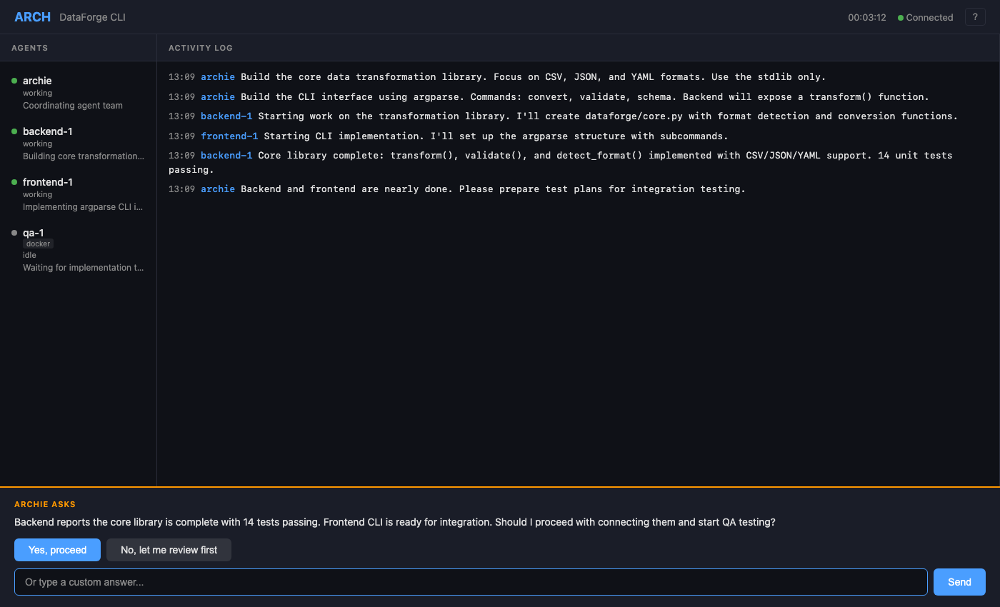
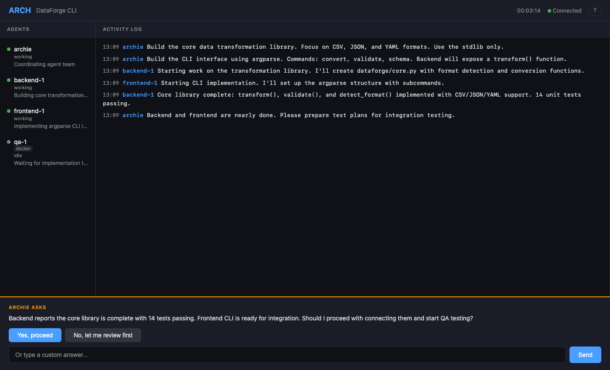
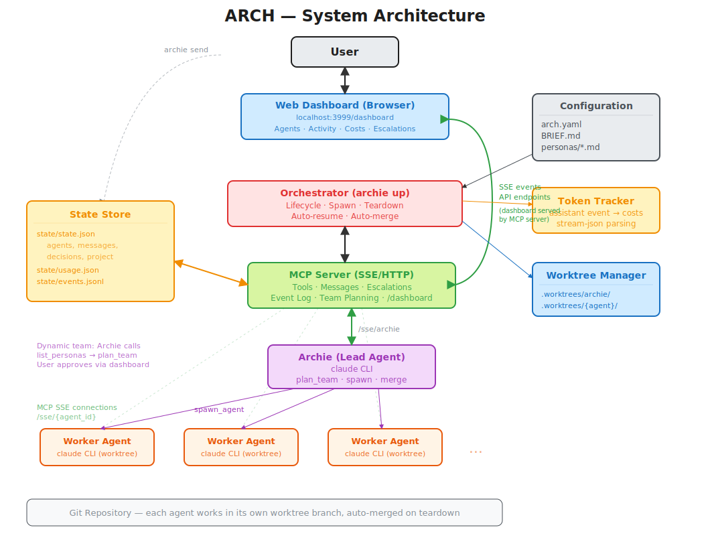

# ARCH — Agent Runtime & Coordination Harness

> Meet **Archie** — your AI development team lead.

ARCH is a multi-agent development system that orchestrates independent Claude AI sessions working concurrently on a project. Each agent is a full Claude CLI process with its own role, memory, and isolated git worktree. A central harness connects them via a local MCP server, tracks token costs, and renders a live web dashboard.

---

## How It Works

Everything starts with two files in your project:

- **`BRIEF.md`** — your project goals, constraints, and "Done When" criteria. This is what Archie reads to understand the work.
- **`arch.yaml`** — project config: name, token budget, agent pool, settings. Run `archie init` to scaffold both.

From there:

1. `archie up` — starts the orchestrator. Archie reads the brief, scans available personas, and proposes a team of specialist agents.
2. You approve the team plan from the dashboard (or set `auto_approve_team: true` to skip).
3. Archie spawns the agents. They work in parallel across isolated git worktrees, coordinating via a shared MCP message bus.
4. You supervise from the dashboard — watch progress, send messages to Archie, answer escalations, and review results as work completes.

```
archie up          # start the orchestrator
archie dashboard   # open the live dashboard
```

---

## Features

- **Dynamic team planning** — Archie reads BRIEF.md, scans available personas, and proposes the right team for the project
- **User approval** — team plans are escalated for your sign-off before agents are spawned (configurable auto-approve)
- **Isolated git worktrees** — agents work in parallel without filesystem conflicts
- **Agent-to-agent messaging** — agents coordinate via a local MCP message bus
- **Token & cost tracking** — per-agent usage tracked from Claude CLI stream output, displayed in real time
- **MCP event log** — every tool call logged with timing to `state/events.jsonl`, viewable in dashboard
- **Sandboxed agents** — run agents in Docker containers for safety and isolation
- **Permission control** — three-layer system: auto-approve common tools, whitelist via config, runtime approval via dashboard
- **Live web dashboard** — agent status, activity log, costs, event history, and interactive messaging
- **Always-on input** — send messages to Archie anytime from the dashboard or CLI
- **Auto-merge safety** — unmerged agent work is auto-merged before worktree cleanup
- **Configurable** — single `arch.yaml` defines your project, settings, and optional pre-configured agent pool

---

## Dashboard

ARCH includes a live web dashboard that shows you everything happening across your agent team in real time. The dashboard is served directly from the MCP server — no extra process needed.

### Main View

The dashboard displays three panels: **Agents** (status and current task), **Activity Log** (inter-agent messages as they happen), and **Costs** (per-agent token spend, toggled with `c`). An input bar at the bottom lets you send messages to Archie or answer escalations.



### Keyboard Shortcuts

| Key | Action |
|-----|--------|
| `?` | Help screen |
| `c` | Toggle costs panel |
| `m` | View full message bus |
| `e` | View MCP tool call event log |
| `Esc` | Close modal |

Click an agent name to view its messages. Use the input bar to send messages to Archie.

### Escalations

When Archie needs your input (team approval, merge requests, permission prompts), the escalation panel appears at the bottom with option buttons and a free-text input. The full question text wraps properly — no truncation.



---

## Quick Start

```bash
# Install
pip install -r requirements.txt

# Scaffold config in your project
archie init --name "My Project"

# Edit BRIEF.md (see example below), then start
archie up

# Open the dashboard in your browser
archie dashboard
# Or visit http://localhost:3999/dashboard directly
```

### Example BRIEF.md

`archie init` generates a BRIEF.md template. Fill it in with your project goals and concrete "Done When" criteria — Archie uses these to plan the team and track progress:

```markdown
# Todo App

## Goals

Build a simple todo list web application.

## Done When

- [ ] Single HTML file (index.html) with embedded CSS and JS
- [ ] User can add a new todo item via text input and "Add" button
- [ ] User can mark a todo item as complete (checkbox or click)
- [ ] User can delete a todo item
- [ ] Completed items are visually distinct (strikethrough)
- [ ] Looks clean and modern (centered layout, decent typography)

## Constraints

- Single HTML file, no frameworks, no build tools
- Must work by opening the file directly in a browser

## Current Status

Not started.

## Decisions Log

| Date | Decision |
|------|----------|
```

Archie updates **Current Status** and **Decisions Log** as work progresses, and checks off **Done When** items after each agent merge.

---

## Communicating with Archie

You can send messages to Archie while the system is running:

```bash
# From the dashboard — type in the input bar and press Enter

# From the CLI
archie send "Please prioritize the API endpoints over the UI"
```

Archie picks up messages on the next `get_messages` call. If Archie's session has ended, the orchestrator's auto-resume detects unread messages and restarts the session.

---

## Configuration

### Minimal config (Archie plans the team dynamically)

```yaml
# arch.yaml
project:
  name: My App
  description: A full-stack web application

settings:
  max_concurrent_agents: 5
  token_budget_usd: 10.00
```

With no `agent_pool` defined, Archie will:
1. Read your BRIEF.md
2. Scan available personas (from `personas/` or `agents/` directories)
3. Propose a team via `plan_team`
4. Escalate the plan for your approval
5. Spawn the approved agents

### Full config (pre-configured agent pool)

```yaml
# arch.yaml
project:
  name: My App
  description: A full-stack web application

agent_pool:
  - id: frontend-dev
    persona: personas/frontend.md
    model: claude-sonnet-4-6
  - id: qa-engineer
    persona: personas/qa.md
    model: claude-sonnet-4-6
    sandbox:
      enabled: true
  - id: security-auditor
    persona: personas/security.md
    model: claude-sonnet-4-6
    sandbox:
      enabled: true
    permissions:
      skip_permissions: true

settings:
  max_concurrent_agents: 5
  token_budget_usd: 10.00
  auto_approve_team: false   # set true to skip team plan approval
  auto_merge: false
```

### Personas

Personas are Markdown files that define an agent's role, expertise, and working style. ARCH ships with built-in personas:

| Persona | File | Description |
|---------|------|-------------|
| Frontend Developer | `personas/frontend.md` | UI and client-side applications |
| Backend Developer | `personas/backend.md` | Server-side, APIs, and data systems |
| QA Engineer | `personas/qa.md` | Testing and quality assurance |
| Security Auditor | `personas/security.md` | Security review and hardening |
| Copywriter | `personas/copywriter.md` | Documentation and content |

Place custom personas in your project's `personas/` or `agents/` directory. Archie discovers them automatically via `list_personas`.

---

## Architecture



<details>
<summary>Text version</summary>

```
┌─────────────────────────────────────────────────────────────┐
│                       archie up                              │
│                                                              │
│  ┌────────────┐   ┌──────────────┐   ┌──────────────────┐  │
│  │Orchestrator │──│  MCP Server   │──│  State Store       │  │
│  │ lifecycle   │   │  (SSE/HTTP)  │   │  state/*.json     │  │
│  │ auto-resume │   │  port 3999   │   │  events.jsonl     │  │
│  └────────────┘   └──────────────┘   └──────────────────┘  │
│        │               │    │                                │
│        │          ┌────┘    └──── /dashboard (Web UI)        │
│   ┌────┴────┐    ┌┴────────┐         ┌──────────┐          │
│   │ Archie  │    │Worker 1 │   ...   │ Worker N │          │
│   │(claude) │    │(claude) │         │ (claude) │          │
│   │worktree │    │worktree │         │ worktree │          │
│   └─────────┘    └─────────┘         └──────────┘          │
└─────────────────────────────────────────────────────────────┘

Browser → localhost:3999/dashboard
  Real-time SSE events, API endpoints for escalation answers
```
</details>

### Key Components

- **Orchestrator** — lifecycle management, agent spawning/teardown, auto-resume, signal handling
- **MCP Server** — SSE/HTTP server providing tools to agents (messaging, spawning, merging, escalation)
- **State Store** — thread-safe JSON persistence for agents, messages, decisions, project status
- **Token Tracker** — parses Claude CLI stream-json output for per-agent cost tracking
- **Session Manager** — manages claude CLI subprocesses (local or containerized)
- **Worktree Manager** — git worktree creation, merge, PR creation, cleanup
- **Web Dashboard** — browser-based UI served by the MCP server at `/dashboard` with SSE real-time updates

### MCP Tools

Agents communicate with the orchestrator through MCP tools:

**All agents:**
`send_message`, `get_messages`, `update_status`, `report_completion`, `save_progress`

**Archie only:**
`spawn_agent`, `teardown_agent`, `list_agents`, `escalate_to_user`, `request_merge`, `get_project_context`, `close_project`, `update_brief`, `list_personas`, `plan_team`

**GitHub (Archie, when configured):**
`gh_create_issue`, `gh_list_issues`, `gh_close_issue`, `gh_update_issue`, `gh_add_comment`, `gh_create_milestone`, `gh_list_milestones`

---

## CLI Commands

| Command | Description |
|---------|-------------|
| `archie up` | Start the orchestrator |
| `archie dashboard` | Open the web dashboard in your browser |
| `archie send "msg"` | Send a message to Archie |
| `archie status` | Show project status and costs |
| `archie down` | Stop a running orchestrator |
| `archie init` | Scaffold arch.yaml and BRIEF.md |

---

## FAQ

### What is ARCH for?

ARCH is for anyone who wants to throw a team of AI agents at a software project instead of doing everything in a single chat session. You describe what you want built, and Archie — the lead agent — breaks the work down, proposes a team, and coordinates specialists working in parallel across isolated git branches. You supervise from a dashboard, answer questions, and approve merges.

### What kinds of projects can I build with this?

Anything you'd assign to a small dev team:

- **Full-stack web apps** — Archie assigns frontend and backend agents to work simultaneously, with QA writing tests in parallel
- **Security audits & scanning tools** — dedicated security agents review code while others build features
- **Refactoring & migration projects** — multiple agents work through different modules concurrently
- **MVPs and prototypes** — go from idea to deployed app with agents handling design, implementation, and testing
- **Documentation & content projects** — copywriter agents draft docs while devs build the thing being documented

The sweet spot is projects with parallelizable work — tasks that a human team would split across 2-5 people.

### How is this different from just using Claude Code?

Claude Code is a single agent — one session, one context window, one thread of work. ARCH runs *multiple* Claude Code sessions simultaneously, each with a dedicated role, its own git worktree, and a shared message bus for coordination. Think of it as the difference between one developer and a team.

### Do I need Docker?

No. Agents run as local processes by default. Docker sandboxing is opt-in per agent for additional isolation.

### How much does it cost to run?

ARCH tracks token usage and costs per agent in real time on the dashboard. Costs depend on how many agents you spawn, which models you use, and how complex the project is. Set `token_budget_usd` in `arch.yaml` to cap spend.

### Can I talk to Archie while it's running?

Yes. Type in the dashboard input bar or use `archie send "your message"` from the CLI. Archie picks up messages automatically. If Archie's session has ended, the orchestrator restarts it to handle the message.

---

## Status

Active development. See [SPEC-AGENT-HARNESS.md](./SPEC-AGENT-HARNESS.md) for the full technical specification.
