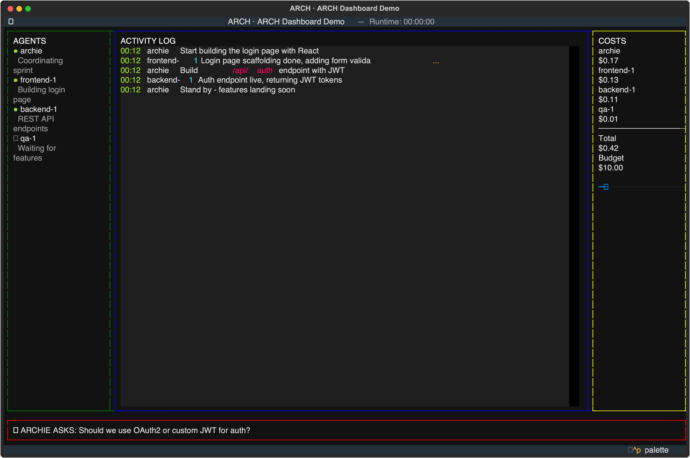
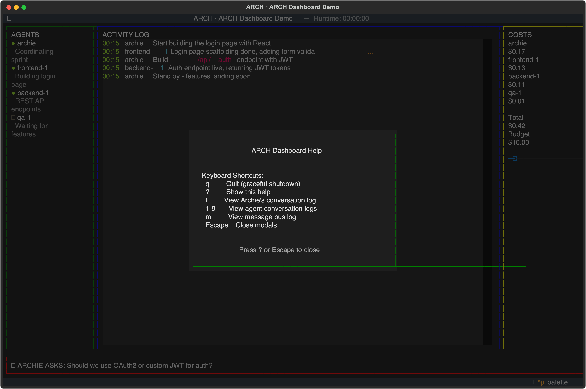
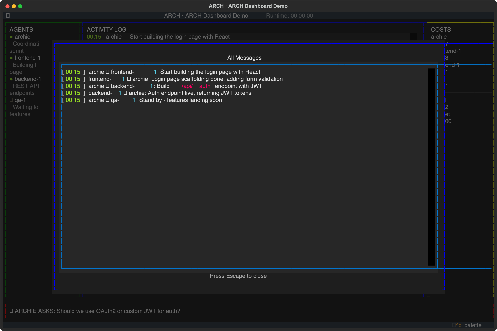

# ARCH — Agent Runtime & Coordination Harness

> Meet **Archie** — your AI development team lead.

ARCH is a multi-agent development system that orchestrates independent Claude AI sessions working concurrently on a software project. Each agent is a full Claude CLI process with its own role, memory, and isolated git worktree. A central harness connects them via a local MCP server, tracks token costs, and renders a live terminal dashboard.

---

## How It Works

```
arch up
```

Archie (the Lead Agent) reads your project, decomposes the work, and dynamically spawns specialist agents — frontend dev, QA engineer, security auditor, and more — each working in parallel in their own git branch. You watch from the dashboard, answer questions when Archie needs a decision, and approve merges when work is ready.

---

## Features

- **Dynamic agent spawning** — Archie decides which specialists to spin up based on the task
- **Isolated git worktrees** — agents work in parallel without filesystem conflicts
- **Agent-to-agent messaging** — agents coordinate via a local MCP message bus
- **Token & cost tracking** — per-agent usage logged in real time
- **Sandboxed agents** — run agents in Docker containers for safety and isolation
- **Permission control** — opt-in `--dangerously-skip-permissions` per agent role, with audit logging
- **Live TUI dashboard** — see agent status, activity, and costs at a glance
- **Configurable** — single `arch.yaml` defines your project, agent pool, and settings

---

## Dashboard

ARCH includes a live terminal dashboard built with [Textual](https://textual.textualize.io/) that shows you everything happening across your agent team in real time.

### Main View

The main dashboard displays four panels: **Agents** (status and current task), **Activity Log** (inter-agent messages as they happen), **Costs** (per-agent token spend and budget), and **Escalations** (questions from Archie that need your input).



### Keyboard Shortcuts

Press `?` from the dashboard to see all available shortcuts — quit, view agent logs, open the full message bus, and more.



### Message Log

Press `m` to open the full message bus showing all inter-agent communication with timestamps, senders, and recipients.



---

## Quick Start

```bash
# Install
pip install -r requirements.txt

# Scaffold config in your project
arch init --name "My Project"

# Start
arch up
```

---

## Configuration

```yaml
# arch.yaml
project:
  name: My App
  description: A full-stack web application

agent_pool:
  - id: frontend-dev
    persona: personas/frontend.md
    model: claude-sonnet-4-6
  - id: qa-engineer
    persona: personas/qa.md
    model: claude-sonnet-4-6
    sandbox:
      enabled: true        # run in Docker container
  - id: security-auditor
    persona: personas/security.md
    model: claude-sonnet-4-6
    sandbox:
      enabled: true
    permissions:
      skip_permissions: true   # requires user confirmation at startup

settings:
  max_concurrent_agents: 5
  token_budget_usd: 10.00
```

---

## FAQ

### What is ARCH for?

ARCH is for anyone who wants to throw a team of AI agents at a software project instead of doing everything in a single chat session. You describe what you want built, and Archie — the lead agent — breaks the work down, spins up specialists (frontend dev, backend dev, QA, security auditor, copywriter), and coordinates them working in parallel across isolated git branches. You supervise from a dashboard, answer questions, and approve merges.

It's the difference between pair-programming with one AI and managing a small AI development shop.

### What kinds of projects can I build with this?

Anything you'd assign to a small dev team:

- **Full-stack web apps** — Archie assigns frontend and backend agents to work simultaneously, with QA writing tests in parallel
- **Security audits & scanning tools** — dedicated security agents review code while others build features
- **Refactoring & migration projects** — multiple agents work through different modules concurrently
- **MVPs and prototypes** — go from idea to deployed app with agents handling design, implementation, and testing
- **Documentation & content projects** — copywriter agents draft docs while devs build the thing being documented

The sweet spot is projects with parallelizable work — tasks that a human team would split across 2-5 people. Single-file scripts don't need an orchestrator. A full-stack app with a dashboard, API, auth, tests, and docs? That's where ARCH shines.

### Has this actually been used to build something?

Yes. A prior iteration of this multi-agent approach was used to build [SkillScan](https://skillscan.appsechq.com), a security scanning tool that analyzes vulnerabilities in AI agent skills. The project involved a coordinated team of AI agents — designer, frontend dev, backend dev, QA — working together to produce a deployed application with a dashboard, scanning engine, severity classification, and analysis notes. It's a concrete example of what a small AI team can ship when properly coordinated.

### How is this different from just using Claude Code?

Claude Code is a single agent — one session, one context window, one thread of work. ARCH runs *multiple* Claude Code sessions simultaneously, each with a dedicated role, its own git worktree, and a shared message bus for coordination. Think of it as the difference between one developer and a team.

### Do I need Docker?

No. Agents run as local processes by default. Docker sandboxing is opt-in per agent for additional isolation (useful for untrusted code execution or security-sensitive roles).

### How much does it cost to run?

ARCH tracks token usage and costs per agent in real time on the dashboard. Costs depend on how many agents you spawn, which models you use, and how complex the project is. You can set a `token_budget_usd` ceiling in `arch.yaml` to cap spend.

---

## Status

Early development. See [SPEC-AGENT-HARNESS.md](./SPEC-AGENT-HARNESS.md) for the full technical specification.
